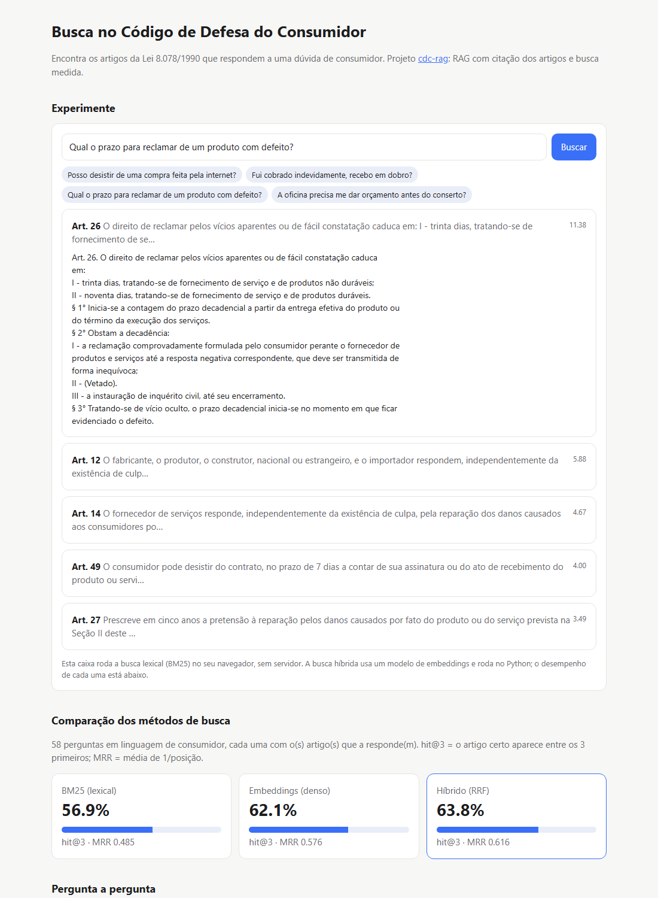

# cdc-rag

[](https://github.com/arthurpenedo/cdc-rag/actions/workflows/ci.yml)
[](https://github.com/arthurpenedo/cdc-rag/actions/workflows/busca.yml)


> Perguntas e respostas sobre o **Código de Defesa do Consumidor** (Lei 8.078/1990) com **RAG**: busca os artigos relevantes, responde com o Claude e **cita os artigos** que embasam cada afirmação. A qualidade da busca é **medida**, não presumida.

## O problema

"Posso desistir de uma compra online?", "Fui cobrado indevidamente, recebo em dobro?". São dúvidas que milhões de consumidores têm, e a resposta está na lei. Um chatbot genérico pode responder com segurança algo que a lei não diz. Aqui a resposta só pode vir dos artigos recuperados, e cada afirmação aponta o artigo de origem.

## Demo

**[arthurpenedo.github.io/cdc-rag](https://arthurpenedo.github.io/cdc-rag/)** — busca no CDC direto no navegador e a comparação dos métodos de busca, pergunta a pergunta. A página é regenerada pelo CI a cada push.

[](https://arthurpenedo.github.io/cdc-rag/)

```text
$ cdc-rag comparar
método       hit@3    MRR
bm25         56.9%  0.485
denso        62.1%  0.576
hibrido      63.8%  0.616

$ cdc-rag buscar "O pacote de biscoito veio com menos gramas do que diz a embalagem" -k 1
[  4.41] Art. 33. Em caso de oferta ou venda por telefone ou reembolso postal, deve constar o nome do fabricante e endereço na embalagem...

$ cdc-rag buscar "O pacote de biscoito veio com menos gramas do que diz a embalagem" -k 1 --metodo hibrido
[  0.03] Art. 19. Os fornecedores respondem solidariamente pelos vícios de quantidade do produto...
```

O comando `cdc-rag perguntar "..."` (com `ANTHROPIC_API_KEY`) devolve a resposta do Claude, a lista de **artigos citados** pela API e os artigos recuperados pela busca.

## Arquitetura

```
Planalto (HTML) ──► scripts/extrair_cdc.py ──► 119 artigos vigentes (JSONL, sem trechos revogados)
                                                      │
                     ┌── BM25 (retrieval.py) ─────────┤
pergunta ──►─────────┤                                ├──► RRF (fusion.py) ──► top-k artigos
                     └── embeddings locais (dense.py) ┘                              │
                         model2vec, chunk por inciso                                 ▼
                                               Claude + blocos `document` com citations: {enabled: true}
                                                                                     │
                                                    resposta + artigos citados (vindos da própria API)
```

- **Corpus:** o extrator baixa o texto compilado do Planalto, **descarta trechos revogados** (que o site mostra riscados) e quebra por artigo, incluindo os artigos com letra (ex.: 54-A a 54-G, superendividamento).
- **Busca lexical:** BM25 implementado do zero, com normalização de acentos, stopwords e radicalização leve em português.
- **Busca densa:** embeddings do [model2vec](https://github.com/MinishLab/model2vec) (`potion-multilingual-128M`), rodando **localmente na CPU**, sem API e sem GPU. Cada inciso/parágrafo vira um vetor (com o caput como contexto) e o artigo recebe a nota do seu melhor trecho.
- **Busca híbrida:** Reciprocal Rank Fusion dos dois rankings.
- **Resposta:** usa as **citações nativas da API do Claude**. Cada artigo é um documento, e a API devolve quais trechos de quais documentos sustentam o texto. Nada de pedir ao modelo que "escreva a fonte entre colchetes".
- **Avaliação:** 58 perguntas com os artigos esperados; mede hit@k e MRR para cada método. Os testes impedem que qualquer método piore a linha de base.
- **Demo:** a página publicada roda o BM25 em JavaScript sobre o índice exportado pelo Python; um teste roda o JS no Node e confere que o ranking é idêntico ao do Python.

### Decisões técnicas

- **Perguntas de avaliação em linguagem de consumidor.** A primeira versão tinha 18 perguntas e o BM25 fazia 77,8%. Ao ampliar para 58 com perguntas como "meu nome pode ficar sujo?" e "boleto precisa ter CNPJ?", o BM25 caiu para 56,9%. O número menor é o honesto: ninguém pergunta usando o vocabulário da lei.
- **model2vec em vez de um transformer completo.** Embeddings estáticos: sem torch, milissegundos por consulta, grátis. O modelo é baixado uma vez (~500 MB) e o CI fixa a revisão para os resultados serem reprodutíveis.
- **Chunk por inciso na busca densa.** Artigos longos como o 39 (práticas abusivas) diluem a média dos vetores quando codificados inteiros. Com chunks, o hit@3 da busca densa subiu de 53,4% para 62,1%.
- **RRF com k = 60, sem ajuste fino.** É o valor do artigo original. Ajustar k nas mesmas 58 perguntas inflaria o resultado; sem um conjunto de validação separado, preferi não fazer.
- **Chunk = artigo na resposta.** O artigo é a unidade natural de citação jurídica, e é assim que um advogado ou o Procon se refere à lei.
- **Erros à vista.** A tabela da demo mostra, pergunta a pergunta, onde cada método acerta ou erra. O BM25 casa "embalagem" com o art. 33; os embeddings entendem "menos gramas" como vício de quantidade (art. 19). Ainda há 21 perguntas em que o híbrido erra (ex.: "Por quanto tempo meu nome pode ficar sujo?"), o que orienta a próxima iteração.

## Como rodar

```bash
git clone https://github.com/arthurpenedo/cdc-rag && cd cdc-rag
pip install -e ".[dev]"                 # só BM25, sem dependências pesadas
pip install -e ".[dev,embeddings]"      # + busca densa e híbrida (baixa o modelo na 1ª execução)

cdc-rag buscar "cobrança indevida" --metodo hibrido
cdc-rag avaliar -k 3 --metodo bm25                 # lista as perguntas em que o método erra
cdc-rag comparar --html site/index.html            # gera a página da demo
cdc-rag perguntar "Qual o prazo para reclamar de um defeito?"   # precisa de ANTHROPIC_API_KEY
python scripts/extrair_cdc.py                      # reconstrói o corpus a partir do Planalto
pytest -q
```

## Próximos passos

- [x] Busca híbrida (BM25 + embeddings) comparada pela mesma avaliação
- [x] Ampliar o conjunto de avaliação (18 → 58 perguntas em linguagem de consumidor)
- [ ] Reranqueamento dos top-10 com um cross-encoder local
- [ ] Separar perguntas de validação e de teste antes de ajustar parâmetros
- [ ] Avaliar a fidelidade das respostas (toda afirmação tem citação?)

> ⚖️ Projeto educacional. Não substitui orientação jurídica, Procon ou Defensoria Pública.

---

Feito por [Arthur Penedo](https://github.com/arthurpenedo) · [LinkedIn](https://www.linkedin.com/in/arthuralves-penedo)
